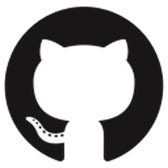

<!-- Header -->

<!-- Website -->
<a href="https://cs-lucasguimaraes.github.io/" target="_blank" style="color: currentColor;">
<picture>
  <source media="(prefers-color-scheme: dark)" srcset="icons/dark-mode/user.png">
  
</picture>
</a>
<!-- GitHub -->
<a href="https://github.com/CS-LucasGuimaraes" target="_blank" style="color: currentColor;">
<picture>
  <source media="(prefers-color-scheme: dark)" srcset="icons/dark-mode/brand-github.png">
  
</picture>
</a>
<!-- LinkedIn -->
<a href="https://linkedin.com/in/cs-lucasguimaraes" target="_blank" style="color: currentColor;">
<picture>
  <source media="(prefers-color-scheme: dark)" srcset="icons/dark-mode/brand-linkedin.png">
  
</picture>
</a>
<!-- Discord -->
<a href="https://discordapp.com/users/294562171877195777
" target="_blank" style="color: currentColor;">
<picture>
  <source media="(prefers-color-scheme: dark)" srcset="icons/dark-mode/brand-discord.png">
  
</picture>
</a>
<!-- email -->
<a href="mailto:cs.lucas.guimaraes@gmail.com" target="_blank" style="color: currentColor;">
<picture>
  <source media="(prefers-color-scheme: dark)" srcset="icons/dark-mode/mail.png">
  
</picture>
</a>

<!-- Presentation -->

<h1 align="center">Hi 👋, I'm Lucas Guimarães</h1>
<h3 align="center">A computer science student from Brazil</h3>

<!-- Body  -->

 

## 🖖 About Me 

  I'm a code architect passionate about solving complex challenges through clever algorithms. I'm driven by the endless possibilities that code and algorithms unlock, shaping a brighter future one line at a time. At the Center of Informatics (CIn) on UFPE, I'm mastering the art of building tech that impacts real-world problems, fueled by a strong belief in the power of collaboration. When I'm not debugging code, you'll find me jamming on the piano, harmonizing my passions for tech and music. Let's team up and create solutions that make a difference!

## 📖 Table of Contents

- [🖖 About Me ](#-about-me-)
- [📖 Table of Contents](#-table-of-contents)
- [⚙️  Technologies ](#️--technologies-)
- [📝 My Projects ](#-my-projects-)
- [🎓 Educational Background ](#-educational-background-)
- [🧑‍💻 Work Experience ](#-work-experience-)
- [✉️ Contact ](#️-contact-)
- [⭐️ Interesting Info ](#️-interesting-info-)

## ⚙️  Technologies 

</a>
</a>
<picture>
<source media="(prefers-color-scheme: dark)" srcset="icons/dark-mode/markdown-original.png">
  
</picture>

<picture>
<source media="(prefers-color-scheme: dark)" srcset="icons/dark-mode/github-original.png">
  
</picture>

<a align="right" href="https://github.com/CS-LucasGuimaraes" target="_blank">
<picture>
<source media="(prefers-color-scheme: dark)" srcset="https://github-readme-stats.vercel.app/api/top-langs/?username=cs-lucasguimaraes&theme=dark">
  
</picture>
</a>

</a>

## 📝 My Projects 

<a align="left" href="https://github.com/CS-LucasGuimaraes/jogo_da_velha" target="_blank">
<picture>
<source media="(prefers-color-scheme: dark)" srcset="https://github-readme-stats.vercel.app/api/pin/?username=CS-LucasGuimaraes&repo=jogo_da_velha&theme=dark&show_owner=true">
  
</picture>
</a> 
<a align="right" href="https://github.com/CS-LucasGuimaraes/MaratonaCIn_Entry-2023" target="_blank">
<picture>
<source media="(prefers-color-scheme: dark)" srcset="https://github-readme-stats.vercel.app/api/pin/?username=CS-LucasGuimaraes&repo=MaratonaCIn_Entry-2023&theme=dark&show_owner=true">
  
</picture>
</a>
<a align="left" href="https://github.com/CS-LucasGuimaraes/lgf_cplib" target="_blank">
<picture>
<source media="(prefers-color-scheme: dark)" srcset="https://github-readme-stats.vercel.app/api/pin/?username=CS-LucasGuimaraes&repo=lgf_cplib&theme=dark&show_owner=true">
  
</picture>
</a>
<a align="right" href="https://github.com/CS-LucasGuimaraes/quadraticalc" target="_blank">
<picture>
<source media="(prefers-color-scheme: dark)" srcset="https://github-readme-stats.vercel.app/api/pin/?username=CS-LucasGuimaraes&repo=QuadratiCalc&theme=dark&show_owner=true">
  
</picture>
</a>

## 🎓 Educational Background 
**Bachelor of Computer Science** *2023~today*  
*Center of Informatics | Centro de Informática (CIn)*  
*Federal University of Pernambuco | Universidade Federal de Pernambuco (UPFE)*

## 🧑‍💻 Work Experience 
**IT Project Manager** ***2020~2021***  
*Super Séries 2020 and 2021 editions* 

  >*In 2020, the pandemic threw a curveball at "Colégio Oficina's" beloved sports project, "Super Séries." With no options, we pivoted the entire event online, and as Project Manager, I had the incredible opportunity to guide 800 students to virtual victory. Imagine the challenge: keeping so many students engaged and connected through online games amidst a global crisis. But with a dedicated team and a passion for sportsmanship, we made it happen.*
  > * **Crafting Engaging Activities:** *We curated a diverse range of online games and challenges, ensuring something for everyone – from esports enthusiasts to casual participants.*
  > * **Fostering a Virtual Community:** *We built online forums and chat rooms, fostering a sense of camaraderie and connection despite the physical distance.*
  > * **Celebrating Achievements:** *We recognized individual and team accomplishments, keeping the competitive spirit alive and motivation high.*
  >
  > **More Than Just Games:**
  >
  > "Super Séries" wasn't just about pixels and points. It was about resilience, adaptability, and the power of community. Seeing students connect, laugh, and cheer each other on, even through screens, was incredibly rewarding.
  >
  > **Key Takeaways:**
  >
  > * **Embracing Innovation:** *I learned to think outside the box and leverage technology to overcome challenges.*
  > * **Leading with Purpose:** *My experience honed my leadership skills and ability to motivate and inspire others.*
  > * **The Power of Community:** *I witnessed firsthand the strength and resilience of communities, even in the face of adversity.*

## ✉️ Contact 
For any further questions or inquiries, reach me at:

<!-- email -->
<a href="mailto:cs.lucas.guimaraes@gmail.com" target="_blank" style="color: currentColor;">
<picture style="position: relative; top: 6px;">
  <source media="(prefers-color-scheme: dark)" srcset="icons/dark-mode/mail.png">
  
</picture> &nbsp; cs.lucas.guimaraes@gmail.com
</a>

<!-- Discord -->
<a href="https://discordapp.com/users/294562171877195777
" target="_blank" style="color: currentColor; ">
<picture style="position: relative; top: 6px;">
  <source media="(prefers-color-scheme: dark)" srcset="icons/dark-mode/brand-discord.png">
  
</picture> &nbsp; @lucat564
</a>

<!-- phone -->
<a href="tel:+5577981142835" target="_blank" style="color: currentColor;">
<picture style="position: relative; top: 6px;">
  <source media="(prefers-color-scheme: dark)" srcset="icons/dark-mode/phone.png">
  
</picture> &nbsp; +55 (77) 9 8114-2835
</a>

## ⭐️ Interesting Info 

* 🔭 Coding my way to the top! Solving problems and climbing the leaderboard in the [MaratonaCIn Entry Contest](https://github.com/CS-LucasGuimaraes/MaratonaCIn_Entry-2023).
* 🌱 I'm currently unraveling the magic of Dynamic Programming!
* 🤘 I'm really in love with rock and roll. My favorite band is Måneskin.
* 😄 Pronouns: He/She | Feel free to use whichever ones feel most natural to you.
* ⚡ Fun fact: I code in white theme, but don't worry, I'm not afraid of the dark. I just prefer my bugs well-lit and easy to swat.  

<picture>
  <source media="(prefers-color-scheme: dark)" srcset="https://raw.githubusercontent.com/CS-LucasGuimaraes/CS-LucasGuimaraes/output/github-contribution-grid-snake-dark.svg">
  
</picture>

